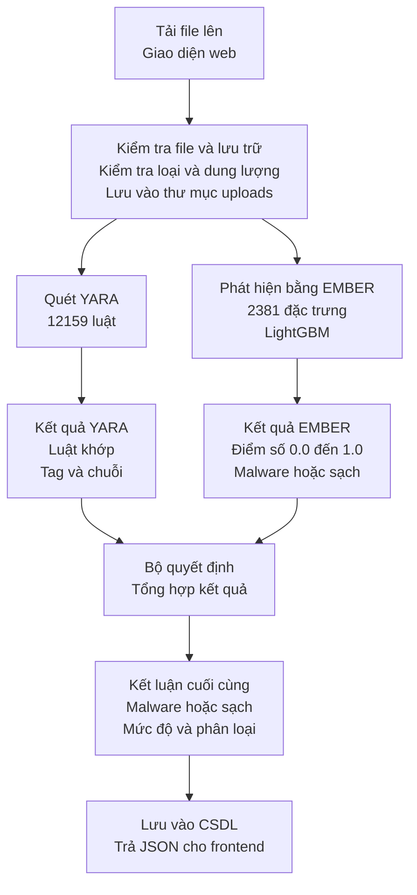
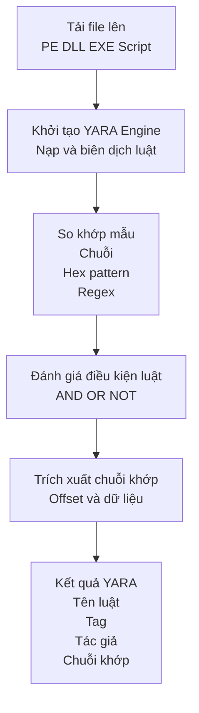
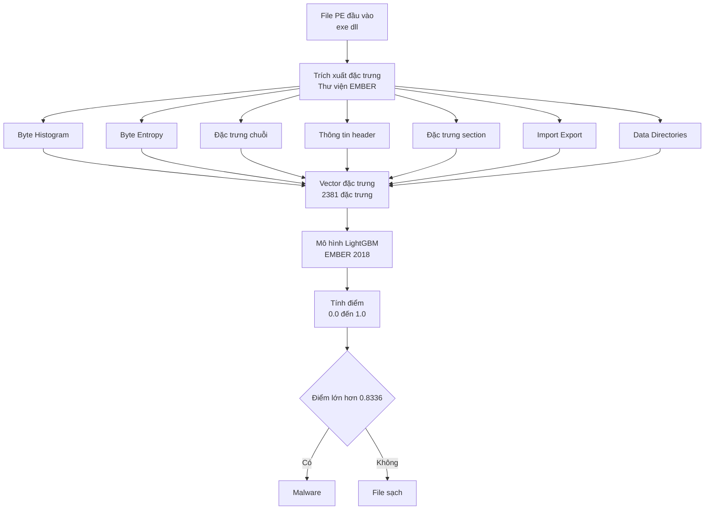

# 🛡️ Malware Detector Web Application

Hệ thống phát hiện mã độc chuyên nghiệp sử dụng **YARA rules**, **hash-based detection**, **PE file analysis**, và **Machine Learning (EMBER)** với kiến trúc **Layered Architecture** hiện đại.

---

## 📖 Tổng Quan Dự Án

### 🎯 Mục Đích

**Malware Detector** là một nền tảng phân tích mã độc tự động, toàn diện, được thiết kế để:

- **Phát hiện malware tự động** trong các file executable, script, và các file đáng ngờ
- **Phân tích tĩnh (Static Analysis)** với nhiều kỹ thuật khác nhau:
  - YARA rules scanning (12,159+ rules)
  - Hash-based detection (SHA256, MD5, SHA1)
  - PE file analysis (Windows executables)
  - Suspicious strings extraction
  - Machine Learning detection (EMBER model)
- **Quản lý lịch sử phân tích** với database MySQL
- **Batch processing** - Quét nhiều file cùng lúc
- **Cung cấp API** cho tích hợp vào hệ thống khác
- **Giao diện web** thân thiện, hỗ trợ đa ngôn ngữ (Việt, Anh, Trung)

### 🏗️ Kiến Trúc Hệ Thống

Dự án được xây dựng theo **kiến trúc 3-tier** hiện đại:

```
┌─────────────────────────────────────────────────────────┐
│                    Frontend Layer                        │
│  React 18 + TypeScript + Vite + Tailwind CSS            │
│  - Giao diện người dùng (Dashboard, Upload, Analyses)   │
│  - Multi-language support (vi, en, zh)                  │
│  - Real-time updates với WebSocket                       │
│  - Port: 3000 (development)                             │
└──────────────────┬──────────────────────────────────────┘
                   │ HTTP/REST API + WebSocket
┌──────────────────▼──────────────────────────────────────┐
│                    Backend Layer                         │
│  FastAPI (Python 3.10) - Layered Architecture          │
│  ├─ API Layer: HTTP endpoints (RESTful)                │
│  ├─ Services Layer: Business logic                      │
│  ├─ ML Layer: EMBER model, feature extraction           │
│  ├─ Core Layer: Config, Security, Database, Logging    │
│  └─ Port: 5000 (Docker container)                      │
└──────────────────┬──────────────────────────────────────┘
                   │
┌──────────────────▼──────────────────────────────────────┐
│                    Data Layer                            │
│  MySQL 8.0 (Docker) + YARA Rules + EMBER Model          │
│  - Lưu trữ lịch sử phân tích                            │
│  - 12,159+ YARA rules                                   │
│  - EMBER LightGBM model (2381 features)                 │
│  - Malware hash database                                │
└─────────────────────────────────────────────────────────┘
```

---

## 🎯 Chức Năng Chính

### 1. Phát Hiện Malware Tự Động

**Sơ đồ tổng hợp quy trình phát hiện malware:**



#### YARA Rules Scanning
- **12,159+ YARA rules** từ Yara-Rules project (chính thức)
- Phát hiện các loại malware: Trojan, Ransomware, Backdoor, Virus, Worm
- Phát hiện CVE exploits, packers, obfuscators, webshells
- Pattern matching dựa trên strings, hex patterns, regular expressions
- Chi tiết matched strings với offset và data preview

**Sơ đồ luồng YARA Scanning:**



#### Hash-Based Detection
- Tính toán SHA256, MD5, SHA1 của file
- So sánh với malware database (Malware.json)
- Phát hiện nhanh các file đã biết là malware

#### PE File Analysis
- Phân tích cấu trúc PE (Windows executables)
- Trích xuất imports, exports, sections
- Phát hiện packers (UPX, VMProtect, etc.)
- Tính entropy để phát hiện obfuscation
- Phân tích suspicious features

#### Strings Analysis
- Trích xuất strings từ file
- Phát hiện suspicious strings (URLs, IPs, commands)
- Phân tích patterns đáng ngờ

#### Machine Learning Detection (EMBER)
- Sử dụng EMBER model (LightGBM) với 2381 features
- Phát hiện malware dựa trên behavioral patterns
- Score từ 0.0 đến 1.0 (threshold: 0.8336)
- Feature extraction tự động từ PE files

**Pipeline EMBER Detection:**



### 2. Quản Lý Phân Tích

#### Single File Scan
- Upload và quét một file đơn lẻ
- Trả về kết quả chi tiết ngay lập tức
- Lưu kết quả vào database
- Hỗ trợ các loại scan:
  - Full scan (YARA + Hash + EMBER + Static Analysis)
  - YARA only
  - EMBER only

#### Batch Scan
- Upload folder hoặc archive (ZIP, TAR)
- Quét nhiều file cùng lúc (async)
- Theo dõi tiến trình quét qua WebSocket
- Xem kết quả tổng hợp

#### Analysis History
- Lưu trữ tất cả kết quả phân tích
- Tìm kiếm và lọc analyses (theo filename, hash, date)
- Xem chi tiết từng analysis
- Export dữ liệu (CSV, JSON, Excel)

### 3. Rating System
- Đánh giá chất lượng phân tích (1-5 sao)
- Comment và tags
- Thống kê ratings
- Cải thiện chất lượng detection dựa trên feedback

### 4. API & Integration

#### RESTful API
- Đầy đủ endpoints cho tất cả tính năng
- Swagger/OpenAPI documentation tự động tại `/api/docs`
- ReDoc documentation tại `/api/redoc`
- Authentication & Authorization (JWT) - planned
- Rate limiting - planned

#### WebSocket Support
- Real-time progress updates cho batch scan
- Dynamic analysis tracking (tương lai)

### 5. Giao Diện Web

#### Dashboard
- Tổng quan hệ thống
- Thống kê analyses (tổng số, malware detected, etc.)
- Health check status
- Recent analyses
- Quick actions

#### Upload & Scan
- Drag & drop file upload
- Batch upload
- Real-time progress
- Kết quả hiển thị ngay sau khi scan

#### Analysis Results
- Chi tiết YARA matches (rule name, tags, description, author, matched strings)
- PE information (sections, imports, exports, entropy)
- Suspicious strings
- EMBER score và prediction
- Download reports

#### Multi-language Support
- Tiếng Việt (vi)
- English (en)
- 中文 (zh)
- Language switcher trong header

---

## 🏛️ Kiến Trúc Backend (Layered Architecture)

### Core Layer (`app/core/`)
- **Configuration**: Application settings, environment variables
- **Security**: JWT, password hashing, RBAC
- **Dependencies**: Dependency Injection
- **Logging**: Structured logging & audit
- **Database**: MySQL connection pooling

### API Layer (`app/api/v1/routes/`)
- **Endpoints**: HTTP request/response handling
- **Routers**: Route aggregation
- **Validation**: Input validation với Pydantic
- **Endpoints chính**:
  - `POST /api/scan` - Full scan
  - `POST /api/scan/yara` - YARA only
  - `POST /api/scan/ember` - EMBER only
  - `GET /api/analyses` - List analyses
  - `GET /api/analyses/{id}` - Analysis detail
  - `POST /api/scan/batch` - Batch scan
  - `GET /api/search` - Search analyses
  - `GET /api/export` - Export data
  - `GET /api/health` - Health check
  - `WS /api/ws/{task_id}` - WebSocket progress

### Services Layer (`app/services/`)
- **AnalyzerService**: Orchestrator chính - điều phối các service
- **AnalysisService**: CRUD operations cho analyses
- **YaraService**: YARA scanning service
- **HashService**: Hash-based detection
- **StaticAnalyzerService**: PE file static analysis
- **RatingService**: Rating management

### ML Layer (`app/ml/`)
- **EmberModel**: EMBER LightGBM model wrapper
- **EmberFeatureExtractor**: Trích xuất 2381 features từ PE file
- **Predictor**: Prediction logic wrapper

### Models & Schemas
- **Models**: Business entities (`app/models/`)
- **Schemas**: Pydantic validation schemas (`app/schemas/`)

---

## 📁 Cấu Trúc Dự Án

```
PBL6_DetectMalwareApplication-develop/
│
├── 📦 frontend/                    # React Frontend
│   ├── src/
│   │   ├── components/            # React components (Layout, UI, etc.)
│   │   ├── pages/                 # Page components (Dashboard, Upload, Analyses, etc.)
│   │   ├── api/                   # API client (Axios)
│   │   ├── hooks/                 # Custom hooks (useAnalyses, useScan, etc.)
│   │   ├── lang/                  # Language files (vi.json, en.json, zh.json)
│   │   ├── types/                 # TypeScript types
│   │   └── utils/                 # Utility functions
│   ├── public/                    # Static files
│   ├── package.json               # Dependencies
│   ├── vite.config.ts             # Vite configuration
│   └── tailwind.config.js         # Tailwind CSS configuration
│
├── 📦 backend/                    # FastAPI Backend
│   ├── app/
│   │   ├── main.py                # Entry point
│   │   ├── core/                  # Core layer (config, security, database, logging)
│   │   ├── api/                   # API layer (endpoints, routes)
│   │   ├── services/              # Services layer (business logic)
│   │   ├── ml/                    # ML layer (EMBER model, features)
│   │   ├── models/                # Data models
│   │   ├── schemas/               # Pydantic schemas
│   │   └── utils/                 # Utility functions
│   ├── ember/                     # EMBER library (local copy)
│   │   ├── __init__.py
│   │   └── features.py
│   ├── yara_rules/                # YARA rules database
│   │   └── rules/
│   │       └── index.yar           # Compiled YARA rules
│   ├── models/                    # EMBER model files
│   │   └── ember_model_2018.txt   # EMBER LightGBM model
│   ├── config/                    # Docker configuration
│   │   ├── Dockerfile             # Backend Docker image
│   │   └── docker-compose.yml     # Docker Compose configuration
│   ├── scripts/                  # Utility scripts
│   │   └── normalize_model.py     # Normalize EMBER model line endings
│   ├── requirements.txt           # Python dependencies
│   └── README.md                  # Backend documentation
│
├── 📁 uploads/                    # Upload folder (mounted in Docker)
├── 📁 logs/                       # Log files (mounted in Docker)
└── 📄 README.md                   # This file
```

---

## 🚀 Hướng Dẫn Triển Khai trên Ubuntu (VMware)

### 📋 Yêu Cầu Hệ Thống

#### Ubuntu VM (VMware)
- **OS**: Ubuntu 20.04 LTS hoặc 22.04 LTS
- **RAM**: Tối thiểu 4GB (khuyến nghị 8GB+)
- **Disk**: Tối thiểu 20GB free space
- **CPU**: 2+ cores (khuyến nghị 4+ cores)

#### Phần Mềm Cần Thiết
- **Docker Engine** 20.10+
- **Docker Compose** 2.0+
- **Node.js** 16+ (cho frontend)
- **npm** hoặc **yarn** (cho frontend)
- **Git** (để clone repository)

---

## 🔧 Cài Đặt và Cấu Hình

### Bước 1: Cài Đặt Docker trên Ubuntu

```bash
# Update package index
sudo apt-get update

# Install prerequisites
sudo apt-get install -y \
    ca-certificates \
    curl \
    gnupg \
    lsb-release

# Add Docker's official GPG key
sudo mkdir -p /etc/apt/keyrings
curl -fsSL https://download.docker.com/linux/ubuntu/gpg | sudo gpg --dearmor -o /etc/apt/keyrings/docker.gpg

# Set up Docker repository
echo \
  "deb [arch=$(dpkg --print-architecture) signed-by=/etc/apt/keyrings/docker.gpg] https://download.docker.com/linux/ubuntu \
  $(lsb_release -cs) stable" | sudo tee /etc/apt/sources.list.d/docker.list > /dev/null

# Install Docker Engine và Docker Compose
sudo apt-get update
sudo apt-get install -y docker-ce docker-ce-cli containerd.io docker-compose-plugin

# Verify installation
docker --version
docker compose version

# Add user to docker group (để chạy docker không cần sudo)
sudo usermod -aG docker $USER
# Logout và login lại để áp dụng thay đổi
```

### Bước 2: Cài Đặt Node.js cho Frontend

```bash
# Cài đặt Node.js 18.x (LTS)
curl -fsSL https://deb.nodesource.com/setup_18.x | sudo -E bash -
sudo apt-get install -y nodejs

# Verify installation
node --version
npm --version
```

### Bước 3: Clone Repository

```bash
# Clone repository (hoặc copy project vào VM)
cd ~
git clone <repository-url> PBL6_DetectMalwareApplication-develop
cd PBL6_DetectMalwareApplication-develop
```

### Bước 4: Cấu Hình Backend (Docker)

#### 4.1. Tạo file `.env` (tùy chọn)

Tạo file `.env` trong thư mục `backend/` nếu muốn override default values:

```bash
cd backend
cat > .env << EOF
# Database Configuration
DB_USER=sa
DB_PASSWORD=your_secure_password_here
DB_NAME=malwaredetection
DB_PORT=3306

# Backend Configuration
BACKEND_PORT=5000
ENV=production

# CORS Configuration - Cho phép frontend kết nối
# Thay đổi IP nếu frontend chạy trên máy khác
CORS_ORIGINS=http://localhost:3000,http://localhost:5173,http://127.0.0.1:3000,http://127.0.0.1:5173,http://<VM_IP>:3000
EOF
```

**Lưu ý**: 
- File `.env` không bắt buộc vì đã có default values trong `docker-compose.yml`
- `CORS_ORIGINS` cần bao gồm URL của frontend để tránh lỗi CORS
- Nếu frontend chạy trên máy khác, thêm IP của VM vào `CORS_ORIGINS`

#### 4.2. Kiểm tra cấu trúc thư mục

Đảm bảo các thư mục và file sau tồn tại:

```bash
backend/
├── config/
│   ├── docker-compose.yml    # ✅ Phải có
│   └── Dockerfile            # ✅ Phải có
├── requirements.txt          # ✅ Phải có
├── ember/                    # ✅ Thư viện ember (phải có)
│   ├── __init__.py
│   └── features.py
├── yara_rules/               # ✅ YARA rules (phải có)
│   └── rules/
│       └── index.yar
└── models/                   # ✅ EMBER model (phải có)
    └── ember_model_2018.txt
```

#### 4.3. Build và chạy Backend với Docker

```bash
# Di chuyển vào thư mục backend
cd backend

# Build và start services (MySQL + Backend)
docker compose -f config/docker-compose.yml up -d --build

# Xem logs để kiểm tra
docker compose -f config/docker-compose.yml logs -f
```

**Lưu ý**: 
- Lần đầu build có thể mất 5-10 phút (download images, install dependencies)
- Backend sẽ tự động tạo database và tables khi start
- Kiểm tra logs để đảm bảo không có lỗi

#### 4.4. Kiểm tra Backend đã chạy

```bash
# Kiểm tra containers đang chạy
docker compose -f config/docker-compose.yml ps

# Kiểm tra health check
curl http://localhost:5000/api/health

# Hoặc mở browser: http://localhost:5000/api/docs
```

**Kết quả mong đợi**:
- Container `malware-mysql` đang chạy
- Container `malware-backend` đang chạy
- Health check trả về `{"status": "healthy", ...}`
- Swagger docs có thể truy cập tại `http://localhost:5000/api/docs`

### Bước 5: Cấu Hình và Chạy Frontend

#### 5.1. Cài đặt dependencies

```bash
# Di chuyển vào thư mục frontend
cd ../frontend

# Cài đặt dependencies
npm install

# Hoặc nếu dùng yarn
yarn install
```

#### 5.2. Cấu hình API URL

Tạo file `.env` trong thư mục `frontend/`:

```bash
cat > .env << EOF
# API URL - Backend chạy trong Docker
VITE_API_URL=http://localhost:5000/api

# Nếu frontend chạy trên máy khác, thay localhost bằng IP của VM
# VITE_API_URL=http://<VM_IP>:5000/api
EOF
```

#### 5.3. Chạy Frontend Development Server

```bash
# Chạy development server
npm run dev

# Hoặc
yarn dev
```

**Kết quả**:
- Frontend chạy tại: `http://localhost:3000`
- Tự động mở browser (hoặc mở thủ công)
- Frontend sẽ proxy `/api` requests đến `http://localhost:5000`

#### 5.4. Kiểm tra Frontend đã chạy

- Mở browser: `http://localhost:3000`
- Kiểm tra Dashboard hiển thị
- Kiểm tra Health Status là "Healthy"
- Thử upload một file để test

---

## 🐳 Chi Tiết Docker Configuration

### Docker Compose Services

#### 1. MySQL Service
- **Image**: `mysql:8.0`
- **Container name**: `malware-mysql`
- **Port**: `3306:3306` (mapped to host)
- **Database**: `malwaredetection`
- **User**: `sa` (default)
- **Password**: `123456` (default, nên thay đổi)
- **Volume**: `mysql_data` (persistent storage)

#### 2. Backend Service
- **Build context**: `backend/` (parent directory)
- **Dockerfile**: `backend/config/Dockerfile`
- **Container name**: `malware-backend`
- **Port**: `5000:5000` (mapped to host)
- **Workers**: 4 (uvicorn workers)
- **Volumes**:
  - `../uploads:/app/uploads` - Uploaded files
  - `../logs:/app/logs` - Log files
  - `../yara_rules:/app/yara_rules` - YARA rules (có thể update)
  - `../models:/app/models` - EMBER model files
  - `../src/Database/Malware.json:/app/src/Database/Malware.json` - Malware hash DB

### Dockerfile Details

```dockerfile
# Base image: Python 3.10 slim
FROM python:3.10-slim

# Install system dependencies
- build-essential, gcc, libssl-dev, etc.
- yara (YARA engine)

# Install Python dependencies
- Copy requirements.txt
- pip install -r requirements.txt

# Copy application code
- Copy toàn bộ backend/ vào /app

# Expose port 5000
EXPOSE 5000

# Run uvicorn với 4 workers
CMD ["uvicorn", "app.main:app", "--host", "0.0.0.0", "--port", "5000", "--workers", "4"]
```

---

## 🔍 Kiểm Tra và Troubleshooting

### Kiểm Tra Backend (Docker)

```bash
# Xem logs
docker compose -f config/docker-compose.yml logs -f backend

# Xem logs MySQL
docker compose -f config/docker-compose.yml logs -f mysql

# Kiểm tra containers
docker compose -f config/docker-compose.yml ps

# Restart services
docker compose -f config/docker-compose.yml restart

# Stop services
docker compose -f config/docker-compose.yml down

# Stop và xóa volumes (⚠️ Xóa dữ liệu)
docker compose -f config/docker-compose.yml down -v
```

### Kiểm Tra Frontend

```bash
# Xem logs trong terminal (nơi chạy npm run dev)
# Kiểm tra console trong browser (F12)

# Kiểm tra API connection
curl http://localhost:5000/api/health
```

### Các Lỗi Thường Gặp

#### 1. Backend không start được

**Lỗi**: `[ERROR] Failed to load ember library`
- **Nguyên nhân**: Thiếu dependencies (`pandas`, `scikit-learn`)
- **Giải pháp**: Đảm bảo `requirements.txt` có `pandas==2.2.3` và `scikit-learn==1.6.1`

**Lỗi**: `[WARN] EMBER model file not found`
- **Nguyên nhân**: Model file không được mount vào container
- **Giải pháp**: Kiểm tra volume mount trong `docker-compose.yml`, đảm bảo `../models:/app/models`

**Lỗi**: `[LightGBM] [Fatal] Model format error`
- **Nguyên nhân**: Model file có line endings sai (CRLF trên Windows)
- **Giải pháp**: Model sẽ tự động normalize khi load (đã có logic trong `ember_model.py`)

#### 2. Frontend không kết nối được Backend

**Lỗi**: `CORS policy: No 'Access-Control-Allow-Origin' header`
- **Nguyên nhân**: CORS configuration không đúng
- **Giải pháp**: 
  - Kiểm tra `CORS_ORIGINS` trong `docker-compose.yml` hoặc `.env`
  - Đảm bảo frontend URL có trong `CORS_ORIGINS`

**Lỗi**: `Network Error` hoặc `Connection refused`
- **Nguyên nhân**: Backend chưa chạy hoặc port sai
- **Giải pháp**: 
  - Kiểm tra backend đang chạy: `docker compose ps`
  - Kiểm tra port: `curl http://localhost:5000/api/health`
  - Kiểm tra `VITE_API_URL` trong frontend `.env`

#### 3. Database connection error

**Lỗi**: `Can't connect to MySQL server`
- **Nguyên nhân**: MySQL container chưa start hoặc config sai
- **Giải pháp**: 
  - Kiểm tra MySQL container: `docker compose ps`
  - Kiểm tra logs: `docker compose logs mysql`
  - Đợi MySQL khởi động hoàn toàn (có thể mất 30-60 giây)

---

## 📊 API Endpoints

### Scan Endpoints

#### Full Scan
```http
POST /api/scan
Content-Type: multipart/form-data
Body: file (binary)
```

#### YARA Only
```http
POST /api/scan/yara
Content-Type: multipart/form-data
Body: file (binary)
```

#### EMBER Only
```http
POST /api/scan/ember
Content-Type: multipart/form-data
Body: file (binary)
```

### Analyses Endpoints

#### List Analyses
```http
GET /api/analyses?limit=100&offset=0
```

#### Get Analysis Detail
```http
GET /api/analyses/{id}
```

#### Search Analyses
```http
GET /api/search?q={query}&limit=50&offset=0
```

### Export Endpoints

#### Export CSV
```http
GET /api/export/csv?limit=1000&offset=0
```

#### Export JSON
```http
GET /api/export/json?limit=1000&offset=0
```

#### Export Excel
```http
GET /api/export/excel?limit=1000&offset=0
```

### Health Check
```http
GET /api/health
```

### WebSocket
```http
WS /api/ws/{task_id}
```

---

## 🗄️ Database Schema

### Analyses Table
- `id`: Primary key (INT, AUTO_INCREMENT)
- `filename`: Tên file (VARCHAR)
- `file_path`: Đường dẫn file (TEXT)
- `sha256`, `md5`, `sha1`: Hash values (VARCHAR)
- `file_size`: Kích thước file (BIGINT)
- `file_type`: Loại file (VARCHAR)
- `malware_detected`: Boolean (TINYINT)
- `yara_matches`: JSON (danh sách YARA matches)
- `pe_info`: JSON (PE file information)
- `suspicious_strings`: JSON (suspicious strings)
- `capabilities`: JSON (capabilities)
- `ember_score`: EMBER prediction score (FLOAT)
- `ember_is_malware`: EMBER prediction result (TINYINT)
- `analysis_time`: Thời gian phân tích (FLOAT)
- `created_at`: Timestamp (DATETIME)

### YARA Matches Table
- `id`: Primary key
- `analysis_id`: Foreign key → analyses.id
- `rule_name`: Tên YARA rule (VARCHAR)
- `tags`: Tags của rule (JSON)
- `description`: Mô tả rule (TEXT)
- `author`: Tác giả rule (VARCHAR)
- `reference`: Reference URL (TEXT)
- `matched_strings`: JSON (chi tiết matched strings)

### Ratings Table
- `id`: Primary key
- `analysis_id`: Foreign key → analyses.id
- `rating`: 1-5 sao (INT)
- `comment`: Comment (TEXT)
- `tags`: Tags (JSON)
- `created_at`: Timestamp (DATETIME)

---

## 🔧 Công Nghệ Sử Dụng

### Frontend
- **React 18**: UI framework
- **TypeScript**: Type safety
- **Vite**: Build tool (fast HMR)
- **Tailwind CSS**: Utility-first CSS framework
- **React Router**: Client-side routing
- **Axios**: HTTP client
- **React Query**: Data fetching & caching
- **i18next**: Internationalization (vi, en, zh)
- **React Icons**: Icon library

### Backend
- **FastAPI**: Modern web framework (Python)
- **Python 3.10+**: Programming language
- **Uvicorn**: ASGI server (4 workers)
- **MySQL 8.0**: Database (Docker)
- **YARA**: Malware detection engine
- **Pydantic**: Data validation
- **LightGBM**: Machine Learning framework (EMBER model - chính)
- **LIEF**: PE file parsing
- **Pandas**: Data processing (cho ember library)
- **Scikit-learn**: ML utilities (cho ember library - GridSearchCV, metrics, FeatureHasher)

### Infrastructure
- **Docker**: Containerization (backend)
- **Docker Compose**: Orchestration
- **MySQL**: Database container

---

## 📚 Tài Liệu Tham Khảo

### Backend Documentation
- **Backend README**: `backend/README.md` - Chi tiết về backend architecture
- **Docker Setup**: `backend/config/DOCKER_SETUP.md` - Hướng dẫn Docker chi tiết
- **Architecture**: `backend/ARCHITECTURE.md` - Kiến trúc chi tiết

### Frontend Documentation
- **Frontend README**: `frontend/README.md` - Chi tiết về frontend

### API Documentation
- **Swagger UI**: `http://localhost:5000/api/docs` (khi backend chạy)
- **ReDoc**: `http://localhost:5000/api/redoc` (khi backend chạy)

### External Resources
- **YARA Rules**: https://github.com/Yara-Rules/rules
- **EMBER Model**: https://github.com/endgameinc/ember
- **FastAPI**: https://fastapi.tiangolo.com/
- **React**: https://react.dev/

---

## 🎓 Đánh Giá Dự Án

### ✅ Ưu Điểm

#### 1. Kiến Trúc Hiện Đại
- **Layered Architecture**: Tách biệt concerns rõ ràng, dễ maintain
- **Dependency Injection**: Loose coupling, dễ test
- **Repository Pattern**: Abstraction cho database access
- **Use Case Pattern**: Business logic được tổ chức tốt

#### 2. Tính Năng Phong Phú
- **12,159+ YARA rules**: Phát hiện nhiều loại malware
- **Multi-technique detection**: YARA + Hash + PE + Strings + EMBER ML
- **Batch processing**: Xử lý nhiều file hiệu quả
- **History management**: Lưu trữ và quản lý kết quả
- **Multi-language support**: Hỗ trợ 3 ngôn ngữ

#### 3. Performance & Scalability
- **Async/Await**: Xử lý bất đồng bộ, tăng throughput
- **Database indexing**: Tối ưu query performance
- **Caching**: YARA rules được compile một lần ở startup
- **Docker support**: Dễ deploy và scale
- **Multi-worker**: 4 uvicorn workers cho backend

#### 4. Developer Experience
- **Type hints**: Type safety với Python typing và TypeScript
- **Auto documentation**: Swagger/OpenAPI tự động
- **Error handling**: Comprehensive error handling
- **Logging**: Structured logging cho debugging
- **Hot reload**: Vite HMR cho frontend development

#### 5. Security
- **Input validation**: Pydantic schemas
- **CORS configuration**: Secure cross-origin requests
- **JWT authentication**: Secure API access (planned)
- **RBAC**: Role-based access control (planned)

#### 6. User Experience
- **Modern UI**: React + TypeScript + Tailwind CSS
- **Responsive design**: Hoạt động tốt trên mọi thiết bị
- **Real-time updates**: WebSocket support
- **Export features**: CSV, JSON, Excel
- **Multi-language**: Hỗ trợ 3 ngôn ngữ

### ⚠️ Nhược Điểm & Hạn Chế

#### 1. Static Analysis Only
- **Chỉ phân tích tĩnh**: Không có dynamic analysis (sandbox)
- **Không chạy file**: Không thể phát hiện behavior-based malware
- **Giới hạn với obfuscation**: Một số malware obfuscated có thể không phát hiện được

#### 2. YARA Rules Dependency
- **Phụ thuộc vào rules**: Chất lượng phụ thuộc vào YARA rules
- **False positives**: Có thể có false positives
- **Cần cập nhật thường xuyên**: Rules cần được cập nhật liên tục

#### 3. Performance với File Lớn
- **Memory usage**: File lớn có thể tốn nhiều memory
- **Processing time**: File lớn mất nhiều thời gian phân tích
- **Không có streaming**: Phải load toàn bộ file vào memory

#### 4. Database Dependency
- **MySQL required**: Cần MySQL để lưu lịch sử
- **Single database**: Chưa hỗ trợ multiple databases
- **No replication**: Chưa có database replication

### 📈 Đánh Giá Tổng Thể

| Tiêu Chí | Điểm | Nhận Xét |
|----------|------|----------|
| **Kiến Trúc** | ⭐⭐⭐⭐⭐ | Layered architecture hiện đại, dễ maintain |
| **Tính Năng** | ⭐⭐⭐⭐⭐ | Phong phú, đầy đủ các kỹ thuật detection |
| **Performance** | ⭐⭐⭐⭐ | Tốt với async/await, multi-worker, nhưng cần optimize cho file lớn |
| **Security** | ⭐⭐⭐⭐ | Tốt, nhưng cần thêm authentication/authorization đầy đủ |
| **Scalability** | ⭐⭐⭐⭐ | Tốt với Docker, nhưng cần thêm load balancing |
| **Documentation** | ⭐⭐⭐⭐⭐ | Tài liệu đầy đủ, chi tiết |
| **Code Quality** | ⭐⭐⭐⭐ | Code sạch, có type hints, nhưng cần thêm tests |
| **User Experience** | ⭐⭐⭐⭐⭐ | UI hiện đại, multi-language, responsive |

**Tổng Điểm: 4.5/5.0** ⭐⭐⭐⭐⭐

---

## 🚀 Hướng Phát Triển

### Ngắn Hạn
- ✅ Hoàn thiện authentication & authorization
- ✅ Thêm unit tests và integration tests
- ✅ Cải thiện error handling
- ✅ Optimize performance cho file lớn
- ✅ Thêm more ML models

### Trung Hạn
- 🔄 Dynamic analysis (sandbox)
- 🔄 Real-time monitoring dashboard
- 🔄 Advanced reporting với charts
- 🔄 API rate limiting và throttling

### Dài Hạn
- 🔮 Cloud-native architecture (Kubernetes)
- 🔮 Multi-tenant support
- 🔮 Advanced threat intelligence
- 🔮 AI-powered detection với deep learning

---

## 🎯 Ứng Dụng Thực Tế

### 1. Bảo Mật Hệ Thống
- **Quét file download**: Kiểm tra file trước khi mở
- **USB scanning**: Quét USB/storage devices
- **Scheduled scanning**: Quét folder hệ thống định kỳ
- **Email attachment scanning**: Quét file đính kèm email

### 2. Nghiên Cứu & Phân Tích
- **Malware research**: Nghiên cứu và phân tích malware samples
- **Threat intelligence**: Thu thập thông tin về threats
- **Incident response**: Hỗ trợ incident response

### 3. Tích Hợp Hệ Thống
- **CI/CD integration**: Tích hợp vào pipeline
- **SIEM integration**: Tích hợp vào SIEM systems
- **API integration**: Sử dụng API để tích hợp vào hệ thống khác

### 4. Giáo Dục & Đào Tạo
- **Security training**: Dạy về malware detection
- **Reverse engineering**: Học về reverse engineering
- **Threat analysis**: Phân tích threats

---

## 🎓 Kết Luận

**Malware Detector** là một hệ thống phát hiện mã độc **chuyên nghiệp, hiện đại, và toàn diện**. Với kiến trúc layered architecture, 12,159+ YARA rules, EMBER Machine Learning model, và nhiều kỹ thuật phân tích khác nhau, hệ thống có khả năng phát hiện nhiều loại malware một cách hiệu quả.

**Điểm mạnh chính:**
- ✅ Kiến trúc hiện đại, dễ maintain và mở rộng
- ✅ Tính năng phong phú, đáp ứng nhiều use cases
- ✅ Performance tốt với async/await và multi-worker
- ✅ Tài liệu đầy đủ, chi tiết
- ✅ Multi-language support
- ✅ Docker deployment dễ dàng

**Điểm cần cải thiện:**
- ⚠️ Thêm dynamic analysis (sandbox)
- ⚠️ Cải thiện performance với file lớn
- ⚠️ Thêm authentication/authorization đầy đủ
- ⚠️ Thêm unit tests và integration tests

**Ứng dụng thực tế:**
- 🎯 Bảo mật hệ thống
- 🎯 Nghiên cứu & phân tích malware
- 🎯 Tích hợp vào hệ thống khác
- 🎯 Giáo dục & đào tạo

**Đánh giá tổng thể: 4.5/5.0** ⭐⭐⭐⭐⭐

---

## 📞 Hỗ Trợ

Nếu gặp vấn đề, vui lòng:
1. Kiểm tra logs: `docker compose logs -f`
2. Kiểm tra health check: `curl http://localhost:5000/api/health`
3. Xem tài liệu: `backend/README.md`, `frontend/README.md`
4. Kiểm tra API docs: `http://localhost:5000/api/docs`

---

**Chúc bạn sử dụng thành công! 🚀**
