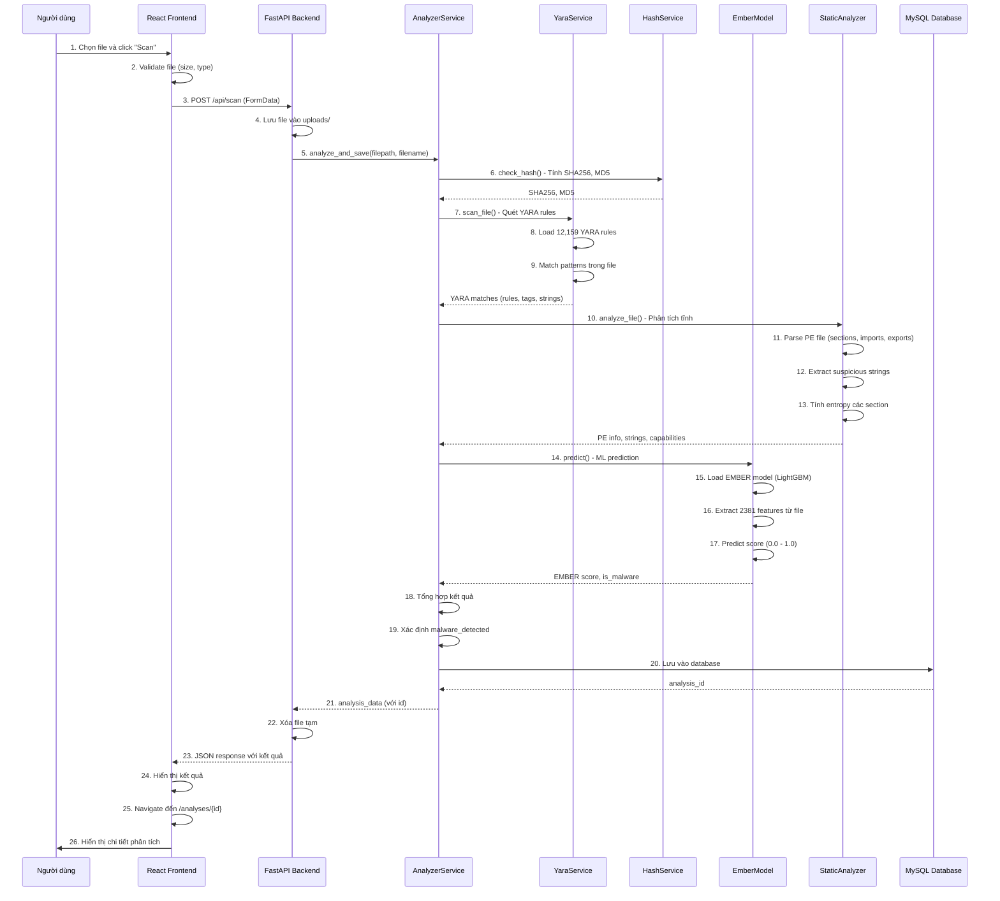

# Tài Liệu API và Quy Trình Xử Lý Phân Tích Malware

## Mục Lục

1. [Tổng Quan Hệ Thống](#tổng-quan-hệ-thống)
2. [Danh Sách API Endpoints](#danh-sách-api-endpoints)
3. [Quy Trình Phân Tích File Chi Tiết](#quy-trình-phân-tích-file-chi-tiết)
4. [Kiến Trúc Xử Lý](#kiến-trúc-xử-lý)
5. [Ví Dụ Request/Response](#ví-dụ-requestresponse)

---

## Tổng Quan Hệ Thống

Hệ thống phát hiện malware sử dụng kiến trúc **3-tier**:
- **Frontend**: React 18 + TypeScript + Vite (Port 3000)
- **Backend**: FastAPI + Python 3.10 (Port 5000)
- **Database**: MySQL 8.0

### Luồng Dữ Liệu Tổng Quan

```
┌─────────────┐         HTTP/REST API         ┌─────────────┐
│  Frontend   │ ────────────────────────────> │   Backend   │
│  (React)    │ <──────────────────────────── │  (FastAPI)  │
└─────────────┘         JSON Response         └──────┬──────┘
                                                      │
                                                      ├──> YARA Service (12,159 rules)
                                                      ├──> Hash Service (SHA256, MD5)
                                                      ├──> EMBER Model (ML - 2381 features)
                                                      ├──> Static Analyzer (PE, Strings)
                                                      └──> Database (MySQL)
```

---

## Danh Sách API Endpoints

### 1. Scan APIs (`/api/scan`)

#### 1.1. POST `/api/scan` - Full Scan (Mặc định)
**Mô tả**: Upload và quét file với tất cả modules (Hash + YARA + EMBER + Static Analysis)

**Request**:
```http
POST /api/scan
Content-Type: multipart/form-data

file: [File object]
```

**Response**:
```json
{
  "filename": "malware.exe",
  "sha256": "abc123...",
  "md5": "def456...",
  "yara_matches": [...],
  "pe_info": {...},
  "suspicious_strings": [...],
  "capabilities": [...],
  "malware_detected": true,
  "analysis_time": 3.45,
  "results": [...]
}
```

**Xử lý**:
1. Nhận file từ FormData
2. Lưu file vào `uploads/` folder
3. Gọi `analyzer_service.analyze_and_save()` với `scan_modules=None` (chạy tất cả)
4. Xóa file tạm sau khi xử lý
5. Trả về kết quả

**Code Reference**: `backend/app/api/v1/routes/scan.py:23-70`

---

#### 1.2. POST `/api/scan/yara` - YARA Only
**Mô tả**: Chỉ quét bằng YARA rules (nhanh, phù hợp cho mọi loại file)

**Request**:
```http
POST /api/scan/yara
Content-Type: multipart/form-data

file: [File object]
```

**Response**: Tương tự Full Scan nhưng chỉ có YARA matches

**Xử lý**:
1. Nhận file
2. Gọi `analyzer_service.analyze_and_save()` với `scan_modules=["yara"]`
3. Trả về kết quả

**Code Reference**: `backend/app/api/v1/routes/scan.py:72-109`

---

#### 1.3. POST `/api/scan/ember` - EMBER Only
**Mô tả**: Chỉ phân tích bằng EMBER model (chỉ hỗ trợ PE files)

**Request**:
```http
POST /api/scan/ember
Content-Type: multipart/form-data

file: [File object]
```

**Response**: Tương tự Full Scan nhưng chỉ có EMBER score

**Xử lý**:
1. Nhận file
2. Kiểm tra file có phải PE không (phải có MZ header)
3. Nếu không phải PE → trả về lỗi 400
4. Gọi `analyzer_service.analyze_and_save()` với `scan_modules=["ember"]`
5. Trả về kết quả

**Code Reference**: `backend/app/api/v1/routes/scan.py:111-177`

---

### 2. Batch Scan APIs (`/api/scan`)

#### 2.1. POST `/api/scan/folder-upload` - Upload Folder
**Mô tả**: Upload nhiều file từ folder và quét tất cả

**Request**:
```http
POST /api/scan/folder-upload
Content-Type: multipart/form-data

files: [File1, File2, File3, ...]
```

**Response**:
```json
{
  "batch_id": "uuid-1234-5678",
  "total_files": 10,
  "status": "pending",
  "processed": 0,
  "completed": 0,
  "failed": 0
}
```

**Xử lý**:
1. Nhận danh sách files từ FormData
2. Kiểm tra tổng kích thước (max 2GB)
3. Lưu tất cả files vào `uploads/temp_{batch_id}/`
4. Tạo batch job trong memory (`batch_jobs` dict)
5. Chạy `process_batch_scan()` trong background task
6. Trả về batch_id ngay lập tức

**Code Reference**: `backend/app/api/v1/routes/batch_scan.py:237-318`

---

#### 2.2. GET `/api/scan/batch/{batch_id}/status` - Check Status
**Mô tả**: Kiểm tra trạng thái batch scan (polling)

**Request**:
```http
GET /api/scan/batch/{batch_id}/status
```

**Response**:
```json
{
  "batch_id": "uuid-1234-5678",
  "total_files": 10,
  "status": "processing",
  "processed": 7,
  "completed": 6,
  "failed": 1
}
```

**Xử lý**:
1. Tìm batch job trong `batch_jobs` dict
2. Trả về trạng thái hiện tại

**Code Reference**: `backend/app/api/v1/routes/batch_scan.py:421-435`

---

#### 2.3. GET `/api/scan/batch/{batch_id}` - Get Results
**Mô tả**: Lấy kết quả chi tiết của batch scan

**Request**:
```http
GET /api/scan/batch/{batch_id}
```

**Response**:
```json
{
  "batch_id": "uuid-1234-5678",
  "status": "completed",
  "total_files": 10,
  "processed": 10,
  "completed": 9,
  "failed": 1,
  "results": [
    {
      "filename": "file1.exe",
      "sha256": "...",
      "malware_detected": true,
      "analysis_id": 123
    }
  ],
  "errors": [
    {
      "filename": "file2.exe",
      "error": "Error message"
    }
  ]
}
```

**Code Reference**: `backend/app/api/v1/routes/batch_scan.py:402-418`

---

### 3. Analyses APIs (`/api/analyses`)

#### 3.1. GET `/api/analyses` - List Analyses
**Mô tả**: Lấy danh sách tất cả analyses với phân trang

**Request**:
```http
GET /api/analyses?limit=20&offset=0
```

**Response**:
```json
{
  "items": [
    {
      "id": 1,
      "filename": "malware.exe",
      "sha256": "...",
      "malware_detected": true,
      "created_at": "2025-01-01T00:00:00"
    }
  ],
  "total": 100
}
```

**Code Reference**: `backend/app/api/v1/routes/analyses.py`

---

#### 3.2. GET `/api/analyses/{id}` - Get Analysis Detail
**Mô tả**: Lấy chi tiết một analysis

**Request**:
```http
GET /api/analyses/123
```

**Response**: Analysis object với đầy đủ thông tin

---

#### 3.3. DELETE `/api/analyses/{id}` - Delete Analysis
**Mô tả**: Xóa một analysis

**Request**:
```http
DELETE /api/analyses/123
```

---

### 4. Health Check API

#### 4.1. GET `/api/health` - Health Check
**Mô tả**: Kiểm tra trạng thái hệ thống

**Request**:
```http
GET /api/health
```

**Response**:
```json
{
  "status": "healthy",
  "message": "All systems operational"
}
```

**Code Reference**: `backend/app/api/v1/routes/health.py`

---

### 5. Export APIs (`/api/export`)

#### 5.1. GET `/api/export/analyses/csv` - Export CSV
**Mô tả**: Xuất danh sách analyses ra CSV

**Request**:
```http
GET /api/export/analyses/csv?limit=1000&offset=0
```

**Response**: CSV file (download)

---

#### 5.2. GET `/api/export/analyses/json` - Export JSON
**Mô tả**: Xuất danh sách analyses ra JSON

---

#### 5.3. GET `/api/export/analyses/excel` - Export Excel
**Mô tả**: Xuất danh sách analyses ra Excel

---

## Quy Trình Phân Tích File Chi Tiết

### Flow Diagram



---

### Chi Tiết Từng Bước

#### Bước 1-3: Frontend Upload File

**File**: `frontend/src/pages/Upload/Upload.tsx`

1. **Người dùng chọn file**:
   - Click button "Choose File" hoặc drag & drop
   - File được lưu vào state: `const [file, setFile] = useState<File | null>(null)`

2. **Validate file**:
   - Kiểm tra kích thước (max 2GB)
   - Nếu scanType = 'ember', kiểm tra file có phải PE không

3. **Gửi request**:
   ```typescript
   // frontend/src/hooks/useScan.ts
   const scan = async (file: File, scanType: ScanType = 'full') => {
     const formData = new FormData()
     formData.append('file', file)
     
     let endpoint = '/scan'
     if (scanType === 'yara') endpoint = '/scan/yara'
     if (scanType === 'ember') endpoint = '/scan/ember'
     
     const response = await axiosClient.post(endpoint, formData, {
       headers: { 'Content-Type': 'multipart/form-data' }
     })
   }
   ```

---

#### Bước 4-5: Backend Nhận File

**File**: `backend/app/api/v1/routes/scan.py`

4. **Lưu file**:
   ```python
   filepath = settings.UPLOAD_FOLDER / file.filename
   with open(filepath, "wb") as f:
       content = await file.read()
       f.write(content)
   ```

5. **Gọi AnalyzerService**:
   ```python
   analysis_data = await analyzer_service.analyze_and_save(
       str(filepath),
       file.filename
   )
   ```

---

#### Bước 6: Hash Service

**File**: `backend/app/services/hash_service.py`

```python
def calculate_hash(self, filepath: str) -> str:
    """Tính SHA256 hash của file"""
    sha256_hash = hashlib.sha256()
    with open(filepath, "rb") as f:
        for chunk in iter(lambda: f.read(4096), b""):
            sha256_hash.update(chunk)
    return sha256_hash.hexdigest()
```

**Kết quả**: SHA256, MD5 hash

---

#### Bước 7-9: YARA Service

**File**: `backend/app/services/yara_service.py`

7. **Load YARA rules**:
   ```python
   # Đã load khi khởi tạo YaraService
   self.rules = settings.get_yara_rules()  # 12,159 rules
   ```

8. **Match patterns**:
   ```python
   matches = self.rules.match(filepath)
   ```

9. **Extract match details**:
   ```python
   for match in matches:
       match_obj = {
           "rule_name": str(match.rule),
           "tags": list(match.tags),
           "description": match.meta.get('description'),
           "author": match.meta.get('author'),
           "matched_strings": [
               {
                   "identifier": s.identifier,
                   "offset": s.offset,
                   "data": s.data.hex(),
                   "data_preview": s.data.decode('ascii', errors='ignore')
               }
               for s in match.strings
           ]
       }
   ```

**Kết quả**: List YARA matches với rule name, tags, matched strings

---

#### Bước 10-13: Static Analyzer

**File**: `backend/app/services/static_analyzer_impl.py`

10. **Parse PE file**:
    ```python
    import lief
    binary = lief.parse(filepath)
    
    pe_info = {
        "machine": binary.header.machine,
        "timestamp": binary.header.time_date_stamps,
        "sections": [
            {
                "name": section.name,
                "entropy": section.entropy,
                "raw_size": section.size,
                "virtual_size": section.virtual_size
            }
            for section in binary.sections
        ],
        "imports": [
            {
                "dll": imp.name,
                "function": func.name
            }
            for imp in binary.imports
            for func in imp.entries
        ]
    }
    ```

11. **Extract strings**:
    ```python
    # Tìm các chuỗi đáng ngờ (URLs, IPs, suspicious keywords)
    strings = extract_strings(filepath)
    suspicious_strings = filter_suspicious(strings)
    ```

12. **Tính entropy**:
    ```python
    for section in binary.sections:
        entropy = calculate_entropy(section.content)
    ```

**Kết quả**: PE info, suspicious strings, capabilities

---

#### Bước 14-17: EMBER Model

**File**: `backend/app/ml/ember_model.py`

14. **Load model**:
    ```python
    # Đã load khi khởi tạo EmberModel
    self.model = lightgbm.Booster(model_file=model_path)
    ```

15. **Extract features**:
    ```python
    from app.ml.features import PEFeatureExtractor
    extractor = PEFeatureExtractor()
    features = extractor.feature_vector(bytez)  # 2381 features
    ```

16. **Predict**:
    ```python
    score = self.model.predict(features.reshape(1, -1))[0]
    is_malware = score >= self.threshold  # threshold = 0.8336
    ```

**Kết quả**: EMBER score (0.0 - 1.0), is_malware (True/False)

---

#### Bước 18-19: Tổng Hợp Kết Quả

**File**: `backend/app/services/analyzer_service.py`

18. **Tổng hợp**:
    ```python
    results = []
    results.extend(hash_results)      # Hash matches
    results.extend(yara_results)      # YARA matches
    results.append(ember_result)       # EMBER score
    
    malware_detected = any(
        result.get("type") in ["hash", "yara", "model"]
        for result in results
    )
    ```

19. **Xác định malware**:
    - Nếu có YARA match → `malware_detected = True`
    - Nếu EMBER score >= threshold → `malware_detected = True`
    - Nếu hash match trong database → `malware_detected = True`

---

#### Bước 20: Lưu Database

**File**: `backend/app/services/analysis_service.py`

```python
analysis_data = {
    'filename': filename,
    'sha256': sha256,
    'md5': md5,
    'file_size': file_size,
    'malware_detected': malware_detected,
    'yara_matches': yara_matches,  # JSON
    'pe_info': pe_info,            # JSON
    'suspicious_strings': strings,  # JSON
    'results': results              # JSON
}

analysis_id = await analysis_service.create(analysis_data)
```

**Database Schema**:
- `analyses` table: Lưu thông tin cơ bản
- `yara_matches` table: Lưu chi tiết YARA matches

---

#### Bước 21-23: Trả Response

**File**: `backend/app/api/v1/routes/scan.py`

21. **Tạo response**:
    ```python
    result = ScanResult(
        filename=file.filename,
        sha256=analysis_data.get("sha256"),
        yara_matches=analysis_data.get("yara_matches", []),
        malware_detected=analysis_data.get("malware_detected", False),
        analysis_time=analysis_data.get("analysis_time", 0.0),
        results=analysis_data.get("results", [])
    )
    return result
    ```

22. **Xóa file tạm**:
    ```python
    if filepath.exists():
        os.remove(filepath)
    ```

23. **Trả về JSON**:
    ```json
    {
      "filename": "malware.exe",
      "sha256": "abc123...",
      "malware_detected": true,
      "yara_matches": [...],
      "results": [...]
    }
    ```

---

#### Bước 24-26: Frontend Hiển Thị

**File**: `frontend/src/pages/Upload/Upload.tsx`

24. **Nhận response**:
    ```typescript
    const { result, loading, error } = useScan()
    // result chứa kết quả từ API
    ```

25. **Navigate**:
    ```typescript
    if (result?.id) {
      navigate(`/analyses/${result.id}`)
    }
    ```

26. **Hiển thị chi tiết**:
    - Component `AnalysisDetail` hiển thị:
      - YARA matches với rule name, tags, matched strings
      - EMBER score và threshold
      - PE information (sections, imports, exports)
      - Suspicious strings
      - Severity assessment (High/Medium/Low)
      - Malware classification

---

## Kiến Trúc Xử Lý

### Service Layer

```
AnalyzerService (Orchestrator)
├── YaraService
│   └── Load & Match YARA rules
├── HashService
│   └── Calculate SHA256, MD5
├── EmberModel
│   ├── Load LightGBM model
│   ├── Extract 2381 features
│   └── Predict score
├── StaticAnalyzerService
│   ├── Parse PE file (LIEF)
│   ├── Extract strings
│   └── Calculate entropy
└── AnalysisService
    └── Save to database
```

### Data Flow

```
File Upload
    ↓
[API Route] scan.py
    ↓
[AnalyzerService] analyze_and_save()
    ↓
    ├──> [HashService] check_hash()
    ├──> [YaraService] scan_file()
    ├──> [EmberModel] predict()
    └──> [StaticAnalyzer] analyze_file()
    ↓
[AnalysisService] create()
    ↓
[Database] MySQL
    ↓
Response JSON
    ↓
[Frontend] Display
```

---

## Ví Dụ Request/Response

### Ví Dụ 1: Full Scan

**Request**:
```bash
curl -X POST "http://localhost:5000/api/scan" \
  -H "Content-Type: multipart/form-data" \
  -F "file=@malware.exe"
```

**Response**:
```json
{
  "filename": "malware.exe",
  "sha256": "80b4182a4fef7b112a87a20d54b8de989d5243edb6b8045b118c976f41a1fd68",
  "md5": "7b106cafd8dd7b2c66de24feda2233ba",
  "yara_matches": [
    {
      "rule_name": "DebuggerException__SetConsoleCtrl",
      "tags": ["AntiDebug", "DebuggerException"],
      "description": "Detects debugger evasion",
      "matched_strings": [
        {
          "identifier": "$s1",
          "offset": 1024,
          "data": "4d5a9000",
          "data_preview": "MZ..."
        }
      ]
    }
  ],
  "pe_info": {
    "machine": 34404,
    "sections": [...],
    "imports": [...]
  },
  "malware_detected": true,
  "analysis_time": 3.26,
  "results": [
    {
      "type": "yara",
      "message": "YARA match: DebuggerException__SetConsoleCtrl",
      "infoUrl": "https://bazaar.abuse.ch/sample/80b4182a..."
    },
    {
      "type": "model",
      "subtype": "ember",
      "message": "[MALWARE] EMBER detection (Score: 0.9234)",
      "score": 0.9234,
      "threshold": 0.8336
    }
  ]
}
```

---

### Ví Dụ 2: Batch Scan

**Request**:
```bash
curl -X POST "http://localhost:5000/api/scan/folder-upload" \
  -H "Content-Type: multipart/form-data" \
  -F "files=@file1.exe" \
  -F "files=@file2.dll"
```

**Response**:
```json
{
  "batch_id": "550e8400-e29b-41d4-a716-446655440000",
  "total_files": 2,
  "status": "pending",
  "processed": 0,
  "completed": 0,
  "failed": 0
}
```

**Check Status**:
```bash
curl "http://localhost:5000/api/scan/batch/550e8400-e29b-41d4-a716-446655440000/status"
```

**Response**:
```json
{
  "batch_id": "550e8400-e29b-41d4-a716-446655440000",
  "total_files": 2,
  "status": "completed",
  "processed": 2,
  "completed": 2,
  "failed": 0
}
```

---

## Tóm Tắt

### Quy Trình Tổng Quan

1. **Frontend**: User upload file → Gửi POST request với FormData
2. **Backend API**: Nhận file → Lưu vào `uploads/` → Gọi AnalyzerService
3. **AnalyzerService**: Điều phối các services:
   - HashService: Tính hash
   - YaraService: Quét YARA rules
   - EmberModel: ML prediction
   - StaticAnalyzer: Phân tích PE, strings
4. **Database**: Lưu kết quả vào MySQL
5. **Response**: Trả về JSON với kết quả
6. **Frontend**: Hiển thị kết quả → Navigate đến detail page

### Thời Gian Xử Lý

- **YARA scan**: ~0.5-2 giây (tùy số lượng rules khớp)
- **EMBER prediction**: ~1-3 giây (load model + extract features + predict)
- **Static analysis**: ~0.5-1 giây (parse PE + extract strings)
- **Tổng cộng**: ~2-6 giây cho một file

### Lưu Ý

- File được xóa sau khi xử lý xong (trong `finally` block)
- Batch scan chạy trong background task (không block API)
- Database lưu tất cả kết quả để xem lại sau
- Frontend có thể poll status cho batch scan

---

**Tài liệu này cung cấp cái nhìn toàn diện về cách hệ thống xử lý phân tích malware từ đầu đến cuối.**

