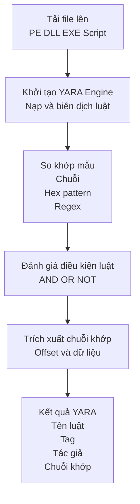
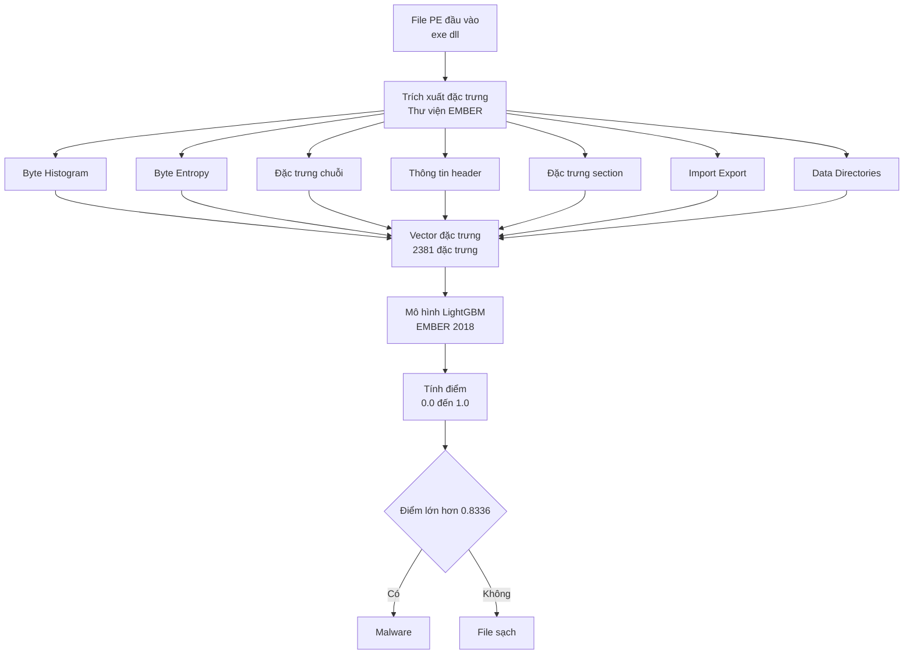
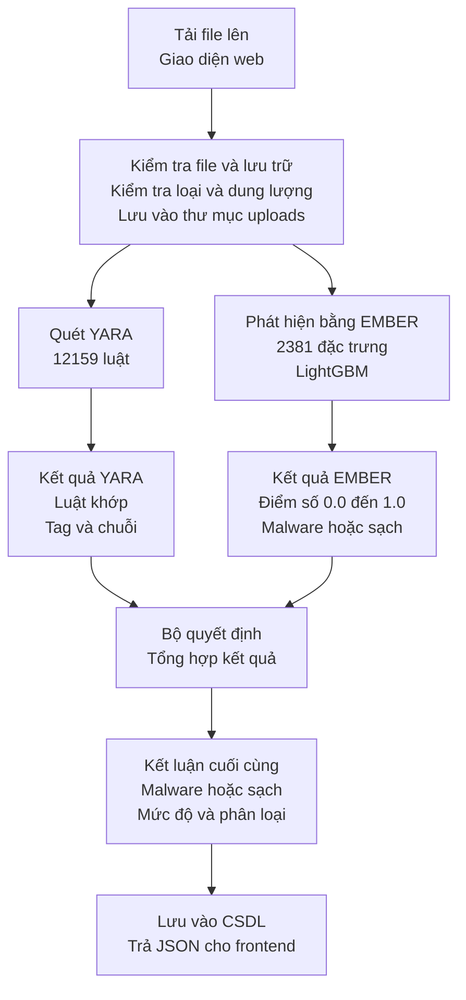

# 3.2. Triển Khai Hệ Thống Phát Hiện Malware

## 3.2.1. Triển khai mô-đun quét mã độc bằng YARA

Mô-đun quét mã độc bằng YARA được triển khai nhằm phát hiện nhanh các mẫu mã độc đã biết hoặc các biến thể có đặc trưng tương đồng. Hệ thống sử dụng bộ **12.159+ YARA rules** được tổng hợp từ các nguồn cộng đồng uy tín, bao phủ nhiều loại mã độc như Trojan, Ransomware, Backdoor, Worm và các kỹ thuật packer, obfuscation.

Trong quá trình triển khai, các rule YARA được biên dịch và nạp sẵn khi hệ thống khởi động, giúp giảm thời gian xử lý khi quét file. Khi người dùng tải file lên, hệ thống sẽ tiến hành quét tệp tin bằng YARA engine để xác định các rule khớp. Kết quả quét bao gồm tên rule, mô tả, tag, tác giả và các chuỗi đặc trưng được phát hiện trong file.

Mô-đun YARA đóng vai trò là lớp phát hiện đầu tiên, cho phép sàng lọc nhanh các mẫu mã độc đã biết với tốc độ cao và độ chính xác tốt, đồng thời cung cấp thông tin định hướng cho các bước phân tích tiếp theo.

### Sơ đồ quy trình quét YARA

**Mô tả quy trình:**

1. **Tải file lên**: Người dùng upload file (PE, DLL, EXE, Script, v.v.) qua giao diện web
2. **Khởi tạo YARA Engine**: Hệ thống nạp và biên dịch 12.159+ YARA rules một lần khi khởi động
3. **So khớp mẫu**: YARA engine quét file với các pattern:
   - Chuỗi ký tự (strings)
   - Hex patterns
   - Regular expressions
4. **Đánh giá điều kiện**: Kiểm tra các điều kiện logic (AND, OR, NOT) trong rule
5. **Trích xuất chuỗi khớp**: Lấy thông tin chi tiết về các chuỗi đã khớp, bao gồm offset và dữ liệu
6. **Kết quả YARA**: Trả về thông tin đầy đủ về rule khớp (tên, tag, tác giả, chuỗi khớp)

---

## 3.2.2. Triển khai mô-đun phân tích Machine Learning (EMBER)

Bên cạnh phương pháp dựa trên chữ ký, hệ thống tích hợp mô-đun học máy sử dụng **EMBER dataset** và mô hình **LightGBM** để phát hiện các mẫu mã độc mới hoặc chưa có rule YARA tương ứng.

Trong mô-đun này, các tệp thực thi Windows (PE files) được trích xuất **2381 đặc trưng tĩnh**, bao gồm thông tin PE header, histogram byte, đặc trưng section, imports/exports và chuỗi ký tự. Các đặc trưng này được chuẩn hóa và đưa vào mô hình LightGBM đã được huấn luyện sẵn.

Mô hình học máy trả về xác suất độc hại (malware score) cho mỗi tệp tin. Dựa trên ngưỡng đã thiết lập (threshold: **0.8336**), hệ thống phân loại file là mã độc hoặc phần mềm hợp lệ. Kết quả phân loại được lưu trữ và hiển thị cho người dùng kèm theo điểm đánh giá, giúp hỗ trợ quá trình ra quyết định.

Mô-đun EMBER giúp hệ thống tăng khả năng tổng quát hóa, phát hiện hiệu quả các biến thể mã độc mới, khắc phục hạn chế của phương pháp phát hiện dựa trên chữ ký truyền thống.

### Sơ đồ Pipeline Machine Learning EMBER

**Mô tả quy trình:**

1. **File PE đầu vào**: Nhận file thực thi Windows (.exe, .dll)
2. **Trích xuất đặc trưng**: Sử dụng thư viện EMBER để trích xuất 7 nhóm đặc trưng:
   - **Byte Histogram**: Phân bố tần suất các byte (256 features)
   - **Byte Entropy**: Entropy của các byte (256 features)
   - **Đặc trưng chuỗi**: Phân tích chuỗi ký tự (100 features)
   - **Thông tin header**: Thông tin từ PE header (92 features)
   - **Đặc trưng section**: Thông tin các section (1000+ features)
   - **Import Export**: Thông tin imports/exports (500+ features)
   - **Data Directories**: Thông tin data directories (200+ features)
3. **Vector đặc trưng**: Tổng hợp thành vector 2381 đặc trưng
4. **Mô hình LightGBM**: Đưa vector vào mô hình EMBER 2018 đã được huấn luyện
5. **Tính điểm**: Mô hình trả về điểm số từ 0.0 (benign) đến 1.0 (malware)
6. **Phân loại**: So sánh với ngưỡng 0.8336 để phân loại:
   - **Score > 0.8336**: Malware
   - **Score ≤ 0.8336**: File sạch

---

## 3.2.3. Kết hợp YARA với Machine Learning

Để tận dụng ưu điểm của cả hai phương pháp, hệ thống được triển khai theo mô hình kết hợp YARA và Machine Learning. Quy trình phân tích bắt đầu bằng việc quét file bằng YARA nhằm phát hiện nhanh các mẫu mã độc đã biết. Đối với các file không khớp rule hoặc có mức độ nghi vấn, hệ thống tiếp tục thực hiện phân tích bằng mô hình học máy EMBER.

Kết quả cuối cùng được tổng hợp từ hai mô-đun, giúp hệ thống vừa đảm bảo tốc độ xử lý nhanh, vừa nâng cao khả năng phát hiện mã độc mới. Việc kết hợp này giúp giảm tỷ lệ false negative, đồng thời hạn chế false positive thông qua việc đối chiếu nhiều nguồn kết quả phân tích.

Mô hình phát hiện lai (hybrid detection) này phù hợp với các hệ thống an toàn thông tin hiện đại, cho phép mở rộng linh hoạt và dễ dàng cập nhật rule YARA cũng như mô hình học máy trong tương lai.

### Sơ đồ quy trình phát hiện malware tổng thể

**Mô tả quy trình:**

1. **Tải file lên**: Người dùng upload file qua giao diện web
2. **Kiểm tra và lưu trữ**: Hệ thống kiểm tra loại file, dung lượng và lưu vào thư mục `uploads/`
3. **Quét song song**: Hệ thống thực hiện hai quy trình song song:
   - **Quét YARA**: Sử dụng 12.159 YARA rules để phát hiện pattern đã biết
   - **Phát hiện EMBER**: Sử dụng mô hình ML với 2381 đặc trưng
4. **Kết quả từng mô-đun**:
   - **Kết quả YARA**: Danh sách rules khớp, tags, và chuỗi đặc trưng
   - **Kết quả EMBER**: Điểm số (0.0-1.0) và phân loại malware/benign
5. **Bộ quyết định**: Tổng hợp kết quả từ cả hai mô-đun:
   - Nếu YARA có match → Malware (độ tin cậy cao)
   - Nếu EMBER score > 0.8336 → Malware (phát hiện mẫu mới)
   - Kết hợp thông tin từ Hash check và PE Analysis
6. **Kết luận cuối cùng**: Xác định:
   - Trạng thái: Malware hoặc File sạch
   - Mức độ nghiêm trọng: High/Medium/Low
   - Phân loại: Trojan/Ransomware/Backdoor/etc.
7. **Lưu trữ và trả kết quả**: Lưu vào MySQL và trả JSON cho frontend để hiển thị

### Ưu điểm của mô hình kết hợp

- **Tốc độ cao**: YARA phát hiện nhanh các mẫu đã biết
- **Phát hiện mẫu mới**: EMBER phát hiện các biến thể chưa có rule
- **Giảm False Negative**: Kết hợp nhiều phương pháp giúp không bỏ sót malware
- **Giảm False Positive**: Đối chiếu nhiều nguồn kết quả giúp tăng độ chính xác
- **Mở rộng linh hoạt**: Dễ dàng cập nhật YARA rules và retrain EMBER model

---

## Tóm tắt

Hệ thống phát hiện malware được triển khai theo mô hình lai (hybrid), kết hợp:

1. **YARA Rules** (12.159+ rules): Phát hiện nhanh các mẫu mã độc đã biết
2. **EMBER ML Model** (2381 features): Phát hiện các biến thể mới và chưa có rule
3. **Decision Engine**: Tổng hợp kết quả từ nhiều nguồn để đưa ra kết luận chính xác

Mô hình này đảm bảo vừa có tốc độ xử lý nhanh, vừa có khả năng phát hiện cao, phù hợp với yêu cầu của hệ thống an toàn thông tin hiện đại.

