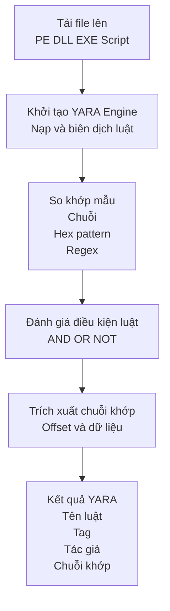
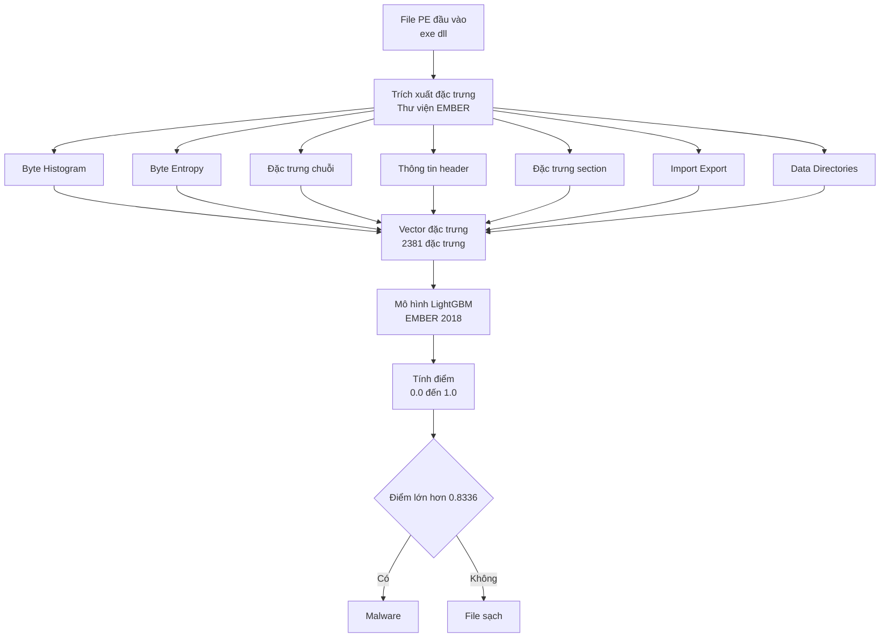
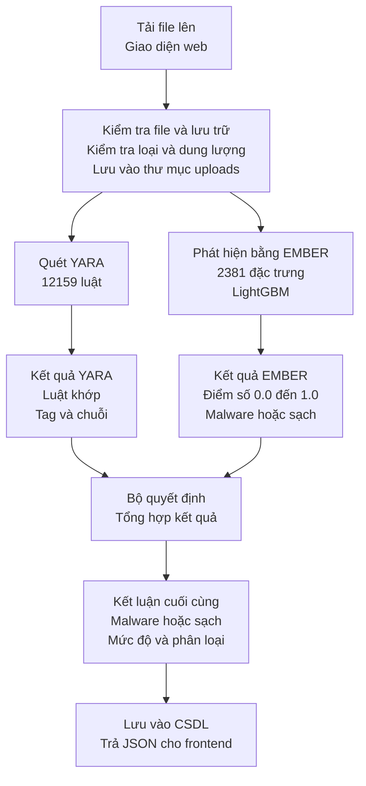
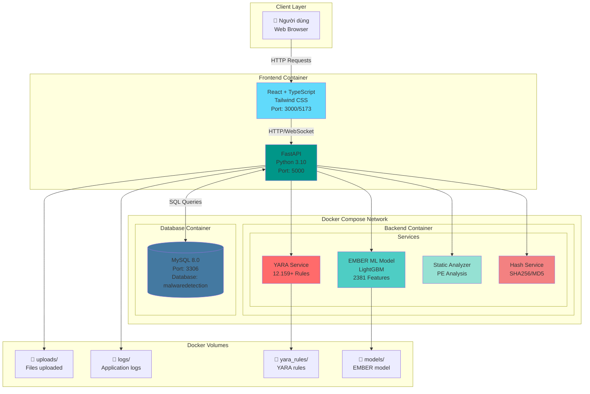

# 3.2. Triển Khai Hệ Thống Phát Hiện Malware

## 3.2.1. Triển khai mô-đun quét mã độc bằng YARA

Mô-đun quét mã độc bằng YARA được triển khai nhằm phát hiện nhanh các mẫu mã độc đã biết hoặc các biến thể có đặc trưng tương đồng. Hệ thống sử dụng bộ **12.159+ YARA rules** được tổng hợp từ các nguồn cộng đồng uy tín, bao phủ nhiều loại mã độc như Trojan, Ransomware, Backdoor, Worm và các kỹ thuật packer, obfuscation.

Trong quá trình triển khai, các rule YARA được biên dịch và nạp sẵn khi hệ thống khởi động, giúp giảm thời gian xử lý khi quét file. Khi người dùng tải file lên, hệ thống sẽ tiến hành quét tệp tin bằng YARA engine để xác định các rule khớp. Kết quả quét bao gồm tên rule, mô tả, tag, tác giả và các chuỗi đặc trưng được phát hiện trong file.

Mô-đun YARA đóng vai trò là lớp phát hiện đầu tiên, cho phép sàng lọc nhanh các mẫu mã độc đã biết với tốc độ cao và độ chính xác tốt, đồng thời cung cấp thông tin định hướng cho các bước phân tích tiếp theo.

### Sơ đồ quy trình quét YARA

```mermaid
flowchart TD
    A[Tải file lên\nPE DLL EXE Script] --> B[Khởi tạo YARA Engine\nNạp và biên dịch luật]

    B --> C[So khớp mẫu\nChuỗi\nHex pattern\nRegex]

    C --> D[Đánh giá điều kiện luật\nAND OR NOT]

    D --> E[Trích xuất chuỗi khớp\nOffset và dữ liệu]

    E --> F[Kết quả YARA\nTên luật\nTag\nTác giả\nChuỗi khớp]
```

**Mô tả quy trình:**

1. **Tải file lên**: Người dùng upload file (PE, DLL, EXE, Script, v.v.) qua giao diện web
2. **Khởi tạo YARA Engine**: Hệ thống nạp và biên dịch 12.159+ YARA rules một lần khi khởi động
3. **So khớp mẫu**: YARA engine quét file với các pattern:
   - Chuỗi ký tự (strings)
   - Hex patterns
   - Regular expressions
4. **Đánh giá điều kiện**: Kiểm tra các điều kiện logic (AND, OR, NOT) trong rule
5. **Trích xuất chuỗi khớp**: Lấy thông tin chi tiết về các chuỗi đã khớp, bao gồm offset và dữ liệu
6. **Kết quả YARA**: Trả về thông tin đầy đủ về rule khớp (tên, tag, tác giả, chuỗi khớp)

---

## 3.2.2. Triển khai mô-đun phân tích Machine Learning (EMBER)

Bên cạnh phương pháp dựa trên chữ ký, hệ thống tích hợp mô-đun học máy sử dụng **EMBER dataset** và mô hình **LightGBM** để phát hiện các mẫu mã độc mới hoặc chưa có rule YARA tương ứng.

Trong mô-đun này, các tệp thực thi Windows (PE files) được trích xuất **2381 đặc trưng tĩnh**, bao gồm thông tin PE header, histogram byte, đặc trưng section, imports/exports và chuỗi ký tự. Các đặc trưng này được chuẩn hóa và đưa vào mô hình LightGBM đã được huấn luyện sẵn.

Mô hình học máy trả về xác suất độc hại (malware score) cho mỗi tệp tin. Dựa trên ngưỡng đã thiết lập (threshold: **0.8336**), hệ thống phân loại file là mã độc hoặc phần mềm hợp lệ. Kết quả phân loại được lưu trữ và hiển thị cho người dùng kèm theo điểm đánh giá, giúp hỗ trợ quá trình ra quyết định.

Mô-đun EMBER giúp hệ thống tăng khả năng tổng quát hóa, phát hiện hiệu quả các biến thể mã độc mới, khắc phục hạn chế của phương pháp phát hiện dựa trên chữ ký truyền thống.

### Sơ đồ Pipeline Machine Learning EMBER

```mermaid
flowchart TD
    A[File PE đầu vào\nexe dll] --> B[Trích xuất đặc trưng\nThư viện EMBER]

    B --> B1[Byte Histogram]
    B --> B2[Byte Entropy]
    B --> B3[Đặc trưng chuỗi]
    B --> B4[Thông tin header]
    B --> B5[Đặc trưng section]
    B --> B6[Import Export]
    B --> B7[Data Directories]

    B1 --> C[Vector đặc trưng\n2381 đặc trưng]
    B2 --> C
    B3 --> C
    B4 --> C
    B5 --> C
    B6 --> C
    B7 --> C

    C --> D[Mô hình LightGBM\nEMBER 2018]

    D --> E[Tính điểm\n0.0 đến 1.0]

    E --> F{Điểm lớn hơn 0.8336}

    F -->|Có| G[Malware]
    F -->|Không| H[File sạch]
```

**Mô tả quy trình:**

1. **File PE đầu vào**: Nhận file thực thi Windows (.exe, .dll)
2. **Trích xuất đặc trưng**: Sử dụng thư viện EMBER để trích xuất 7 nhóm đặc trưng:
   - **Byte Histogram**: Phân bố tần suất các byte (256 features)
   - **Byte Entropy**: Entropy của các byte (256 features)
   - **Đặc trưng chuỗi**: Phân tích chuỗi ký tự (100 features)
   - **Thông tin header**: Thông tin từ PE header (92 features)
   - **Đặc trưng section**: Thông tin các section (1000+ features)
   - **Import Export**: Thông tin imports/exports (500+ features)
   - **Data Directories**: Thông tin data directories (200+ features)
3. **Vector đặc trưng**: Tổng hợp thành vector 2381 đặc trưng
4. **Mô hình LightGBM**: Đưa vector vào mô hình EMBER 2018 đã được huấn luyện
5. **Tính điểm**: Mô hình trả về điểm số từ 0.0 (benign) đến 1.0 (malware)
6. **Phân loại**: So sánh với ngưỡng 0.8336 để phân loại:
   - **Score > 0.8336**: Malware
   - **Score ≤ 0.8336**: File sạch

---

## 3.2.3. Kết hợp YARA với Machine Learning

Để tận dụng ưu điểm của cả hai phương pháp, hệ thống được triển khai theo mô hình kết hợp YARA và Machine Learning. Quy trình phân tích bắt đầu bằng việc quét file bằng YARA nhằm phát hiện nhanh các mẫu mã độc đã biết. Đối với các file không khớp rule hoặc có mức độ nghi vấn, hệ thống tiếp tục thực hiện phân tích bằng mô hình học máy EMBER.

Kết quả cuối cùng được tổng hợp từ hai mô-đun, giúp hệ thống vừa đảm bảo tốc độ xử lý nhanh, vừa nâng cao khả năng phát hiện mã độc mới. Việc kết hợp này giúp giảm tỷ lệ false negative, đồng thời hạn chế false positive thông qua việc đối chiếu nhiều nguồn kết quả phân tích.

Mô hình phát hiện lai (hybrid detection) này phù hợp với các hệ thống an toàn thông tin hiện đại, cho phép mở rộng linh hoạt và dễ dàng cập nhật rule YARA cũng như mô hình học máy trong tương lai.

### Sơ đồ quy trình phát hiện malware tổng thể

```mermaid
flowchart TD
    A[Tải file lên\nGiao diện web] --> B[Kiểm tra file và lưu trữ\nKiểm tra loại và dung lượng\nLưu vào thư mục uploads]

    B --> C[Quét YARA\n12159 luật]
    B --> D[Phát hiện bằng EMBER\n2381 đặc trưng\nLightGBM]

    C --> E[Kết quả YARA\nLuật khớp\nTag và chuỗi]
    D --> F[Kết quả EMBER\nĐiểm số 0.0 đến 1.0\nMalware hoặc sạch]

    E --> G[Bộ quyết định\nTổng hợp kết quả]
    F --> G

    G --> H[Kết luận cuối cùng\nMalware hoặc sạch\nMức độ và phân loại]

    H --> I[Lưu vào CSDL\nTrả JSON cho frontend]
```

**Mô tả quy trình:**

1. **Tải file lên**: Người dùng upload file qua giao diện web
2. **Kiểm tra và lưu trữ**: Hệ thống kiểm tra loại file, dung lượng và lưu vào thư mục `uploads/`
3. **Quét song song**: Hệ thống thực hiện hai quy trình song song:
   - **Quét YARA**: Sử dụng 12.159 YARA rules để phát hiện pattern đã biết
   - **Phát hiện EMBER**: Sử dụng mô hình ML với 2381 đặc trưng
4. **Kết quả từng mô-đun**:
   - **Kết quả YARA**: Danh sách rules khớp, tags, và chuỗi đặc trưng
   - **Kết quả EMBER**: Điểm số (0.0-1.0) và phân loại malware/benign
5. **Bộ quyết định**: Tổng hợp kết quả từ cả hai mô-đun:
   - Nếu YARA có match → Malware (độ tin cậy cao)
   - Nếu EMBER score > 0.8336 → Malware (phát hiện mẫu mới)
   - Kết hợp thông tin từ Hash check và PE Analysis
6. **Kết luận cuối cùng**: Xác định:
   - Trạng thái: Malware hoặc File sạch
   - Mức độ nghiêm trọng: High/Medium/Low
   - Phân loại: Trojan/Ransomware/Backdoor/etc.
7. **Lưu trữ và trả kết quả**: Lưu vào MySQL và trả JSON cho frontend để hiển thị

### Ưu điểm của mô hình kết hợp

- **Tốc độ cao**: YARA phát hiện nhanh các mẫu đã biết
- **Phát hiện mẫu mới**: EMBER phát hiện các biến thể chưa có rule
- **Giảm False Negative**: Kết hợp nhiều phương pháp giúp không bỏ sót malware
- **Giảm False Positive**: Đối chiếu nhiều nguồn kết quả giúp tăng độ chính xác
- **Mở rộng linh hoạt**: Dễ dàng cập nhật YARA rules và retrain EMBER model

---

## Tóm tắt

Hệ thống phát hiện malware được triển khai theo mô hình lai (hybrid), kết hợp:

1. **YARA Rules** (12.159+ rules): Phát hiện nhanh các mẫu mã độc đã biết
2. **EMBER ML Model** (2381 features): Phát hiện các biến thể mới và chưa có rule
3. **Decision Engine**: Tổng hợp kết quả từ nhiều nguồn để đưa ra kết luận chính xác

Mô hình này đảm bảo vừa có tốc độ xử lý nhanh, vừa có khả năng phát hiện cao, phù hợp với yêu cầu của hệ thống an toàn thông tin hiện đại.

---

## 3.3. Triển khai hệ thống hoàn chỉnh

### 3.3.1. Triển khai bằng dự án

Hệ thống phát hiện mã độc được triển khai dưới dạng một dự án phần mềm hoàn chỉnh, bao gồm **Frontend – Backend – Database** và được quản lý bằng **Docker Compose**. Các bước triển khai chính:

#### Cấu trúc dự án:

- **Frontend**: React + TypeScript + Tailwind CSS, cung cấp giao diện web hiện đại, hỗ trợ đa ngôn ngữ.
- **Backend**: FastAPI (Python 3.10), triển khai các dịch vụ quét YARA, phân tích hash, phân tích PE file và mô hình EMBER (LightGBM).
- **Database**: MySQL 8.0, lưu trữ kết quả phân tích, thông tin file, YARA matches và đánh giá người dùng.
- **Docker Compose**: quản lý đồng thời các container, định nghĩa volume cho uploads, logs, rules, models.

#### Sơ đồ kiến trúc triển khai tổng thể

```mermaid
flowchart TB
    subgraph "Client Layer"
        User[👤 Người dùng<br/>Web Browser]
    end

    subgraph "Frontend Container"
        Frontend[React + TypeScript<br/>Tailwind CSS<br/>Port: 3000/5173]
        Frontend --> |HTTP/WebSocket| API
    end

    subgraph "Docker Compose Network"
        subgraph "Backend Container"
            API[FastAPI<br/>Python 3.10<br/>Port: 5000]
            
            subgraph "Services"
                YARA[YARA Service<br/>12.159+ Rules]
                EMBER[EMBER ML Model<br/>LightGBM<br/>2381 Features]
                STATIC[Static Analyzer<br/>PE Analysis]
                HASH[Hash Service<br/>SHA256/MD5]
            end
            
            API --> YARA
            API --> EMBER
            API --> STATIC
            API --> HASH
        end

        subgraph "Database Container"
            DB[(MySQL 8.0<br/>Port: 3306<br/>Database: malwaredetection)]
        end

        API <--> |SQL Queries| DB
    end

    subgraph "Docker Volumes"
        VOL1[📁 uploads/<br/>Files uploaded]
        VOL2[📁 logs/<br/>Application logs]
        VOL3[📁 yara_rules/<br/>YARA rules]
        VOL4[📁 models/<br/>EMBER model]
    end

    API --> VOL1
    API --> VOL2
    YARA --> VOL3
    EMBER --> VOL4

    User --> |HTTP Requests| Frontend

    style Frontend fill:#61dafb
    style API fill:#009688
    style DB fill:#4479a1
    style YARA fill:#ff6b6b
    style EMBER fill:#4ecdc4
    style STATIC fill:#95e1d3
    style HASH fill:#f38181
```

**Mô tả kiến trúc:**

1. **Client Layer**: Người dùng truy cập hệ thống qua trình duyệt web
2. **Frontend Container**: 
   - React + TypeScript + Tailwind CSS
   - Chạy trên port 3000 (production) hoặc 5173 (development)
   - Giao tiếp với Backend qua HTTP/WebSocket
3. **Backend Container**:
   - FastAPI (Python 3.10) chạy trên port 5000
   - Các dịch vụ chính:
     - **YARA Service**: Quét file với 12.159+ YARA rules
     - **EMBER ML Model**: Phân tích ML với LightGBM (2381 features)
     - **Static Analyzer**: Phân tích PE files
     - **Hash Service**: Tính toán và so sánh hash
4. **Database Container**:
   - MySQL 8.0 trên port 3306
   - Database: `malwaredetection`
   - Lưu trữ: analyses, yara_matches, ratings
5. **Docker Volumes**:
   - `uploads/`: Lưu trữ files được upload
   - `logs/`: Logs của ứng dụng
   - `yara_rules/`: YARA rules files
   - `models/`: EMBER model file

#### Quy trình triển khai:

1. **Cài đặt Docker và Docker Compose** trên máy chủ Ubuntu
2. **Build container backend và database** từ Dockerfile
3. **Khởi động toàn bộ hệ thống** bằng lệnh `docker compose up -d`
4. **Kiểm tra backend** qua API `/api/health` và frontend qua địa chỉ `http://localhost:3000`
5. **Upload file thử nghiệm** để xác nhận hệ thống hoạt động

#### Ưu điểm triển khai bằng dự án:

- ✅ **Dễ dàng cài đặt và chạy** trên nhiều môi trường khác nhau
- ✅ **Tính cách ly cao**, đảm bảo an toàn khi phân tích mã độc
- ✅ **Có thể mở rộng và nâng cấp dễ dàng** (thêm rule YARA, cập nhật mô hình ML)
- ✅ **Quản lý tập trung** với Docker Compose
- ✅ **Tự động hóa** quy trình build và deploy

---

### 3.3.2. Giao diện người dùng

Hệ thống cung cấp giao diện web trực quan, thân thiện, giúp người dùng dễ dàng thao tác:

#### Dashboard

- **Hiển thị tổng quan hệ thống**: Số lượng file đã quét, số lượng malware phát hiện, trạng thái hệ thống
- **Cung cấp các hành động nhanh**: Upload file, xem lịch sử phân tích
- **Thống kê trực quan**: Biểu đồ và bảng thống kê theo thời gian
- **Health check status**: Hiển thị trạng thái kết nối với backend

#### Upload & Scan

- **Upload file đơn lẻ**: Quét một file với các tùy chọn:
  - **YARA only**: Chỉ quét bằng YARA rules
  - **EMBER only**: Chỉ phân tích bằng mô hình ML
  - **Full scan** (mặc định): Kết hợp YARA + EMBER + Hash + Static Analysis
- **Hỗ trợ drag & drop**: Kéo thả file trực tiếp vào giao diện
- **Hiển thị tiến trình quét** theo thời gian thực
- **Kết quả trả về ngay** sau khi quét, bao gồm:
  - Thông tin YARA matches (rule name, tags, matched strings)
  - Hash values (SHA256, MD5, SHA1)
  - PE information (sections, imports, exports, entropy)
  - Suspicious strings
  - EMBER score và prediction

#### Batch Scan

- **Upload và quét nhiều file cùng lúc**:
  - **Scan Folder**: Upload toàn bộ folder (hỗ trợ lọc theo extension)
  - **Scan Archive**: Upload file ZIP/TAR/GZ và quét tất cả file bên trong
- **Kết hợp YARA + EMBER**: Batch scan tự động sử dụng **cả hai phương pháp** (YARA + EMBER + Hash + Static Analysis) cho mỗi file
- **Xử lý bất đồng bộ**: Quét nhiều file song song trong background
- **Theo dõi tiến trình**: Hiển thị trạng thái real-time:
  - Tổng số file
  - Số file đã xử lý
  - Số file hoàn thành
  - Số file lỗi
- **Kết quả tổng hợp**: Bảng kết quả với:
  - Tên file
  - Hash (SHA256)
  - Trạng thái (Malware/Clean)
  - Link đến analysis detail

#### Analysis Results

- **Hiển thị chi tiết kết quả phân tích**:
  - Rule YARA khớp với đầy đủ thông tin (tên, mô tả, tác giả, chuỗi khớp)
  - Entropy các section
  - Chuỗi đáng ngờ được phát hiện
  - Kết quả dự đoán ML (EMBER score, threshold, classification)
  - PE information (imports, exports, sections)
- **Tải báo cáo**: Cho phép tải báo cáo dưới dạng CSV, JSON hoặc Excel
- **Severity assessment**: Đánh giá mức độ nghiêm trọng (High/Medium/Low)
- **Malware classification**: Phân loại malware (Trojan, Ransomware, Backdoor, etc.)

#### History & Rating (Analyses)

- **Lưu trữ toàn bộ kết quả phân tích** trước đó
- **Hiển thị dạng bảng** với các cột:
  - ID, Tên file, Hash (SHA256), Trạng thái, Ngày quét
  - Số lượng YARA matches, EMBER score
- **Phân trang**: Hỗ trợ phân trang với số lượng items tùy chọn
- **Tìm kiếm và lọc**:
  - Theo tên file
  - Theo hash (SHA256, MD5)
  - Theo ngày quét
  - Theo trạng thái (malware/benign)
- **Quản lý analyses**:
  - Xóa analysis đơn lẻ
  - Xóa nhiều analyses cùng lúc (bulk delete)
  - Chọn tất cả / Bỏ chọn
- **Đánh giá chất lượng phân tích**:
  - Rating 1–5 sao
  - Thêm bình luận và tags
  - Xem thống kê ratings

#### Search

- **Tìm kiếm toàn văn** trong tất cả analyses
- **Infinite scroll**: Tự động tải thêm kết quả khi cuộn xuống
- **Tìm kiếm theo nhiều tiêu chí**:
  - Tên file
  - Hash (SHA256, MD5)
  - Nội dung phân tích
- **Hiển thị kết quả** với preview thông tin
- **Tổng số kết quả** và số lượng đã tải

#### Đa ngôn ngữ

- **Hỗ trợ 3 ngôn ngữ**:
  - 🇻🇳 Tiếng Việt
  - 🇬🇧 Tiếng Anh
  - 🇨🇳 Tiếng Trung
- **Chuyển đổi ngôn ngữ trực tiếp** trên giao diện qua language switcher
- **Tự động lưu** lựa chọn ngôn ngữ của người dùng

#### Tính năng bổ sung

- **Batch Scan**: Upload và quét nhiều file cùng lúc (folder hoặc archive)
- **Real-time Progress**: Theo dõi tiến trình quét qua WebSocket
- **Export Data**: Xuất dữ liệu phân tích ra nhiều định dạng (CSV, JSON, Excel)
- **Phân trang**: Hỗ trợ phân trang cho danh sách analyses
- **Infinite Scroll**: Tự động tải thêm kết quả khi tìm kiếm
- **Bulk Operations**: Xóa nhiều analyses cùng lúc
- **Responsive Design**: Giao diện tối ưu cho mọi thiết bị (desktop, tablet, mobile)
- **Navigation**: Điều hướng dễ dàng giữa các trang
- **Error Handling**: Xử lý lỗi và hiển thị thông báo rõ ràng
- **Loading States**: Hiển thị trạng thái loading cho mọi thao tác

---

## Tổng kết triển khai

Hệ thống phát hiện malware được triển khai hoàn chỉnh với:

1. **Kiến trúc 3 tầng**: Frontend (React) - Backend (FastAPI) - Database (MySQL)
2. **Containerization**: Sử dụng Docker Compose để quản lý và triển khai
3. **Giao diện hiện đại**: Responsive, đa ngôn ngữ, thân thiện với người dùng
4. **Tính năng đầy đủ**: Upload, scan, phân tích, lưu trữ, đánh giá
5. **Mở rộng dễ dàng**: Có thể thêm rule YARA, cập nhật mô hình ML, mở rộng tính năng

Hệ thống sẵn sàng triển khai trên môi trường production với đầy đủ tính năng và khả năng mở rộng.

